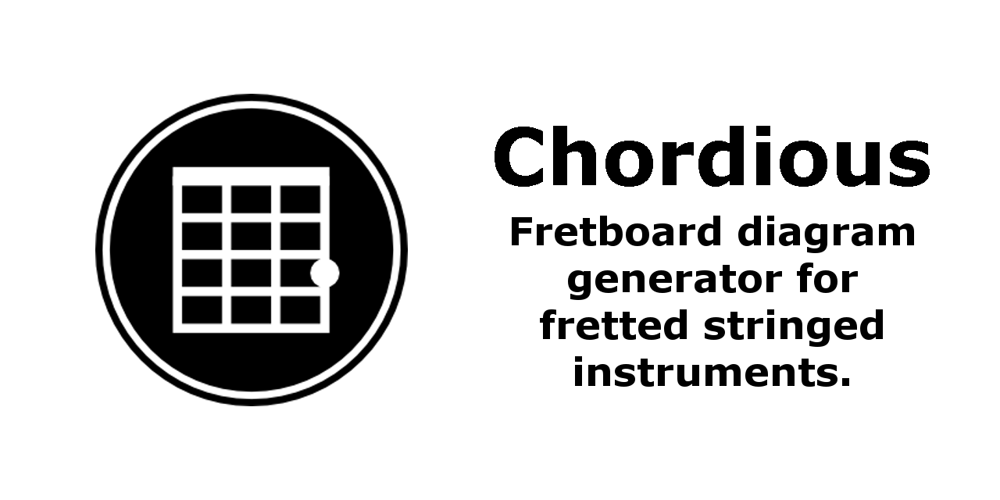

# Chordious #

Chordious is a fretboard diagram generator for fretted stringed instruments like the ukulele, mandolin, and guitar.

**Official Website:** http://chordious.com/

Chordious is for Windows only. See http://chordious.com/download/ for download and installation details.

## Features ##

* Create clean, scalable, fretboard diagrams
* Extensive styling options
* Find chords for all your instruments and tunings with the Chord Finder
* Find scales for all your instruments and tunings with the Scale Finder
* Save and maintain your collections of diagrams in the Diagram Library
* Import your Classic Chordious ChordLine documents
* Export your diagrams as SVG, JPG, or PNG images
* Rich Diagram Editor
* Automatic updates

Chordious is open-source under the MIT license.

Chordious proudly depends on the following open-source projects:

* [MVVM Light Toolkit](http://mvvmlight.net) for MVVM infrastructure
* [SVG.NET](https://github.com/vvvv/SVG) for rendering diagrams
* [Wpf Extended Toolkit](https://github.com/dotnetprojects/WpfExtendedToolkit) for additional controls

Copyright (c) 2013-2022 Jon Thysell
